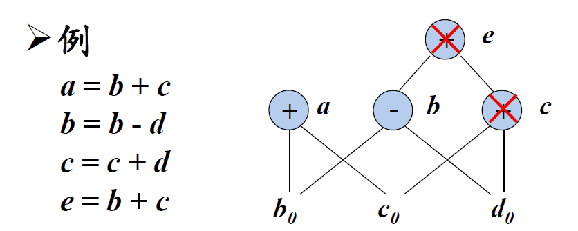

# 优化算法与实现

## 局部优化

### DAG（有向无环图）的构造

- 基本块中的每个语句 s 都对应一个内部结点 N

    - 结点 N 的标号是 s 中的运算符；同时还有一个定值变量表被关联到 N ，表示 s 是在此基本块内最晚对表中变量进行定值的语句
    - N 的子结点是基本块中在 s 之前、最后一个对 s 所使用的运算分量进行定值的语句对应的结点。如果 s 的某个运算分量在基本块内没有在 s 之前被定值，则这个运算分量对应的子结点就是代表该运算分量初始值的叶结点
    - 所有的字面常量都是叶子结点
    - 在为语句 `x = y + z` 构造结点 N 的时候，如果` x` 已经在某结点 M 的定值变量表中，则从 M 的定值变量表中删除变量` x `
    - 对于形如 `x = y + z` 的三地址指令，如果已经有一个结点表示` y + z`，就不往 DAG 中增加新的结点，而是给已经存在的结点附加定值变量 x
- 下图是把一段代码构造成有向无环图的一个简单示例
    - `B = 3`
        - 此时图为空（不含值为3的结点），因此我们先创建一个结点，其值为3
        - 图中不存在表示`= 3`这一操作的结点，因此要创建一个结点，其子结点为3，值为` = `，并为其附加一个标识符`B`

    - `D = A + C`
        - 图中不含有表示`A`和`C`的结点，因此我们创建两个结点，其值分别为`A`和`C`（ $A_0$ 和 $C_0$ 的下标 $0$ 仅标记其为叶子结点，无特殊含义）
        - 图中不存在表示`A + C`这一操作的结点，因此要创建一个结点，其子结点分别为`A`和`C`，值为`+`，并为其附加一个标识符`D`

    - `E = A * C`
        - 图中已经含有表示`A`和`C`的结点，无需创建
        - 图中不存在表示`A * C`这一操作的结点，因此要创建一个结点，其子结点分别为`A`和`C`，值为`*`，并为其附加一个标识符`E`

    - 后续的操作是类似的，但值得注意的三条语句是：`H = A + C`
        - 图中已经含有表示`A`和`C`的结点，无需创建
        - 图中已经存在表示`A + C`这一操作的结点，因此不再创建结点，而是找到这一结点，为其额外附加一个标识符`H`

    - `I = A * C`
        - 图中已经含有表示`A`和`C`的结点，无需创建
        - 图中已经存在表示`A * C`这一操作的结点，因此不再创建结点，而是找到这一结点，为其额外附加一个标识符`I`

    - `K = B * 5`
        - 图中已经含有表示`B`的结点，而不含有表示`5`的结点。但我们注意到，5和`B`事实上均表示一个常量，我们希望在程序的编译期解决这种常量计算，而非将其延后到运行期，因此，此处我们并不创建值为5的结点，而是对`B * 5`这一常量表达式直接进行计算得到数值15，之后处理语句`K = 15`


​	不断重复这种读取和处理的操作，我们最终就能得到一张图，它包含了这段程序的所有信息。


### 基于DAG的无用代码删除

- 从一个DAG上删除所有没有附加活跃变量（活跃变量是指其值可能会在以后被使用的变量，这些变量的求法会在后续提到，此处我们先假定这些变量是已知的）的根结点(即没有父结点的结点) 。重复应用这样的处理过程就可以从DAG中消除所有对应于无用代码的结点。这是一个十分类似于拓扑排序的过程，我们对图进行迭代，每一次迭代中遍历图的所有结点，并判断它们是否满足：

  - 是根结点（入度为0）
  - 不含活跃变量

  如果满足这两点，则删去这个结点。

  如果某一次迭代过后没有删除任何结点，说明当前的所有根结点已经全部是活跃的，此时可以结束操作。

  

- 以下是一个无用代码删除的示例，假设`a`和`b`是活跃变量，但`c`和`d`不是




### 从DAG到基本块的重组

对于一个已经构建并优化完成的DAG，我们需要输出其对应的优化后代码

- 对每个具有若干定值变量的节点，构造一个三地址语句来计算其中某个变量的值
- 如果结点有多个附加的活跃变量，就必须引入复制语句，以便给每一个变量都赋予正确的值

考虑1.1部分构造DAG的示例，假定仅有`L`是活跃变量，则生成的优化后代码如下：


注意到生成的代码之间是存在依赖关系的，它们存在一定顺序，要生成为`L`定值的代码，必须保证已经生成过了关于`K`和`F`的代码，而要生成关于`F`的代码，则必须先生成`E`和`D`的定值代码。容易发现，这是一个非常类似于树的后根序遍历的算法。我们从所有的根结点开始进行一个类似深度优先搜索的过程，使用栈保存所有子结点尚未生成完毕的根结点，以此迭代求解，即可按正确的依赖关系生成优化后的代码。


## 程序流分析

### 基本块的划分

基本块的划分算法比较简单：

- 首先，确定代码序列中哪些是首指令，即基本块的第一条代码，这些代码包括：
  - 代码序列的第一条代码一定是一个首指令
  - 任意一个条件或强制跳转语句的跳转目标是一个首指令
  - 任意一个条件或强制跳转语句的下一条代码是一个首指令
- 然后，每个首指令对应的基本块包含从它自己开始，直到下一个首指令（不含）或者代码序列结尾之间的所有代码


### 活跃变量分析

#### 定值-引用集

为了分析并求出每个基本块的活跃变量，我们为每个基本块定义两个集合：

- $def_B$：在基本块B中被定值，但被定值前在B中没有被引用的变量的集合
- $use_B$：在基本块B中被引用，但被引用前在B中没有被定值的变量的集合

以下是一个定值-引用集的例子：


我们可以以如下方式迭代求解B的两个集合：

对于B中的一条代码E，以$\ x\ $代表其左端的变量（定值变量），以$\ y\ $代表其右端的所有变量（引用变量），则：

- 若 $y \notin def_B$，则$\ use_B\ =use_B \ \cup\ \{y\}$

- 若 $x \notin use_B$，则$\ def_B\ =def_B \ \cup\ \{x\}$


#### 活跃变量的数据流方程

我们约定如下表示：

- $IN_B$：  在基本块B入口处的活跃变量的集合
- $OUT_B$：在基本块B出口处的活跃变量的集合

那么我们可以得到程序活跃变量的数据流方程：
$$
IN_{EXIT}\ =\ \empty \\ \\
IN_B\ =\ use_B\ \cup\ (OUT_B\ -\ def_B) \\ \\
OUT_B\ =\ \cup IN_S
$$
其中，S 是 B 的后继，并且 B ≠ EXIT。

因此我们有如下的迭代算法：

```cpp
for(B in blocks)
	B.in.clear();
while(IN changed)
	for(B in blocks){
		for(S in B.successor){
			B.out = setUnion(B.out, S.in);
			B.in = setUnion(B.use, setDifference(B.out, B.def));
		}
	}
```

### 循环分析

#### 支配结点集

为了寻找程序中的自然循环，我们需要对每个基本块再定义一个支配节点集合

- 如果从流图的入口结点到结点 n 的每条路径都经过结点 d，则称结点 d 支配(dominate)结点 n，记为

$$
d \ dom \ n
$$

- 对每个结点 n，定义

$$
D(n)=\{d\ |\ d\ dom\ n\}
$$

​			表示 n 的支配结点集合


#### 支配结点数据流方程

此处，我们约定如下表示（注意与活跃变量分析定义的区别）：

- $IN_B$：  在基本块B入口处的支配结点的集合
- $OUT_B$：在基本块B出口处的支配结点的集合

于是类似于活跃变量数据流，我们有支配结点数据流方程
$$
OUT_{ENTRY}=\{ENTRY\} \\ \\
OUT_B=IN_B\ \cup\ \{B\} \\ \\
IN_B=\ \cap\ OUT_B
$$
其中，P 是 B 的前驱，并且 B ≠ ENTRY

进而可以以与2.2.2完全类似的方法求解所有基本块的支配结点集合。


#### 回边

- 假定流图中存在两个结点 d 和 n 满足 $d\ dom\ n$。如果存在从结点 n 到 d 的有向边 $n→d$，那么这条边称为回边。


#### 查找自然循环

从程序分析的角度来看，循环在代码中以什么形式出现并不重要，重要的是它是否具有易于优化的性质自然循环是满足以下性质的循环

- 有唯一的入口结点，称为首结点。首结点支配循环中的所有结点，否则，它就不会成为循环的唯一入口
- 循环中至少有一条返回首结点的路径，否则，控制就不可能从“循环”中直接回到循环头，也就无法构成循环

要识别一个自然循环，只需考虑所有的回边 $n→d$，n 与 d 即确定了一个自然循环的首尾。之后使用广度优先搜索即可以将 n 与 d 之间的所有结点加入循环。
